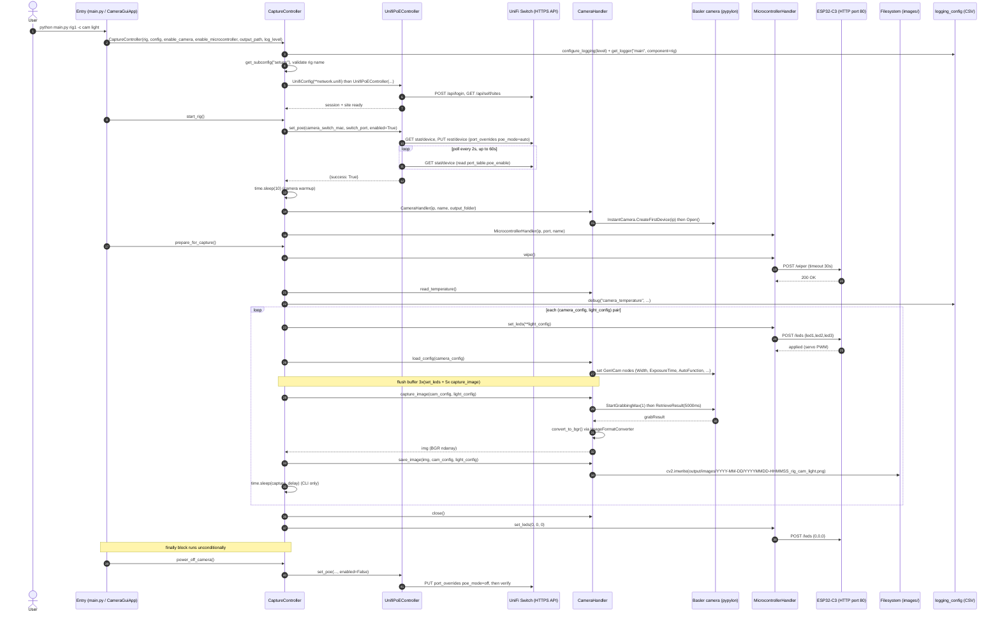
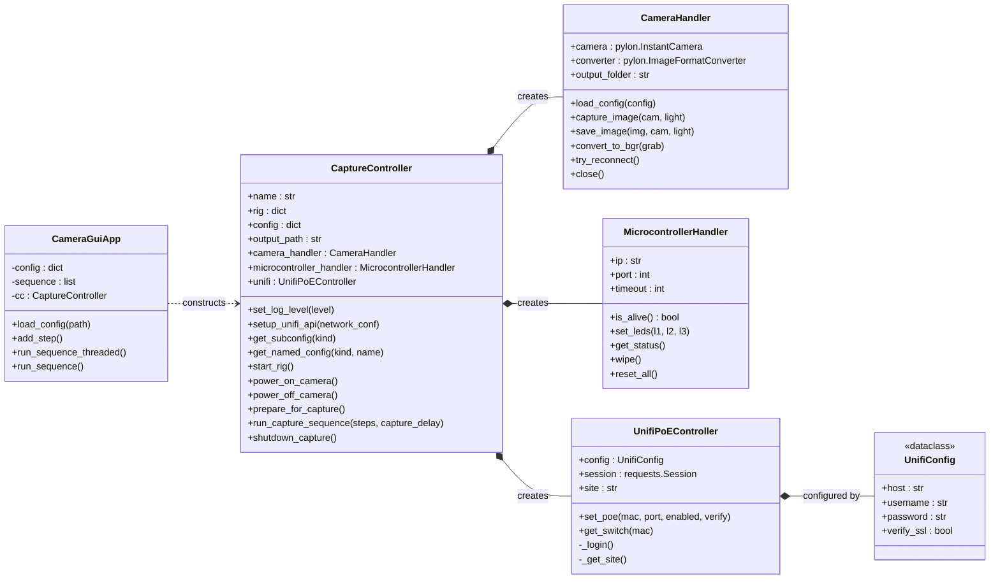
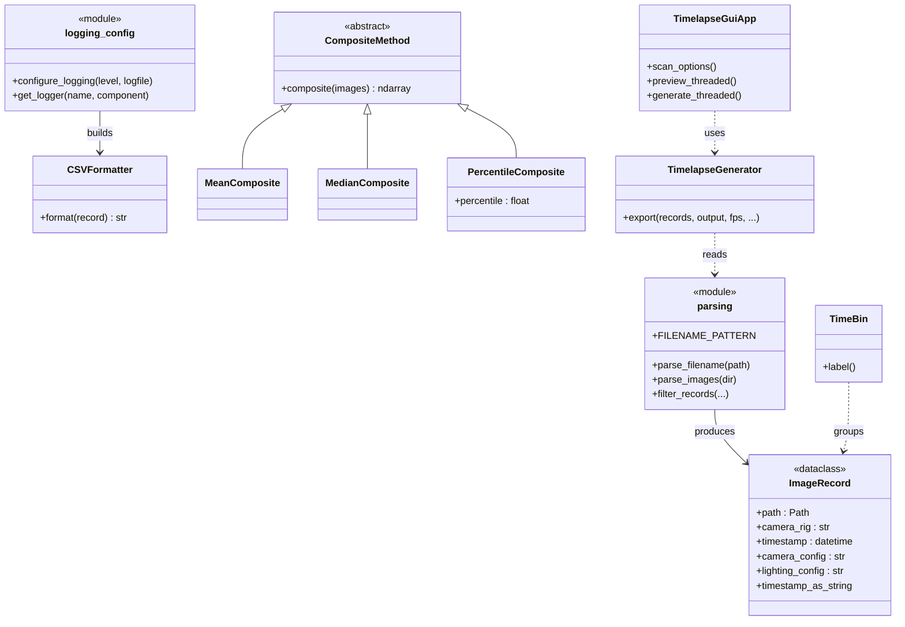
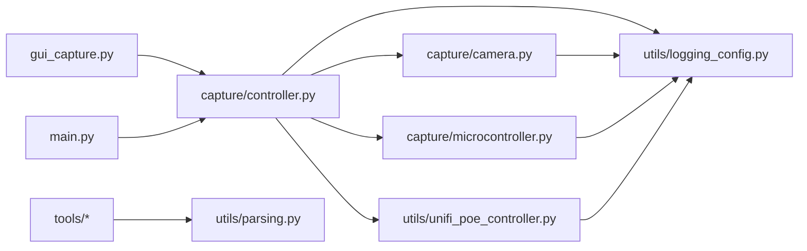
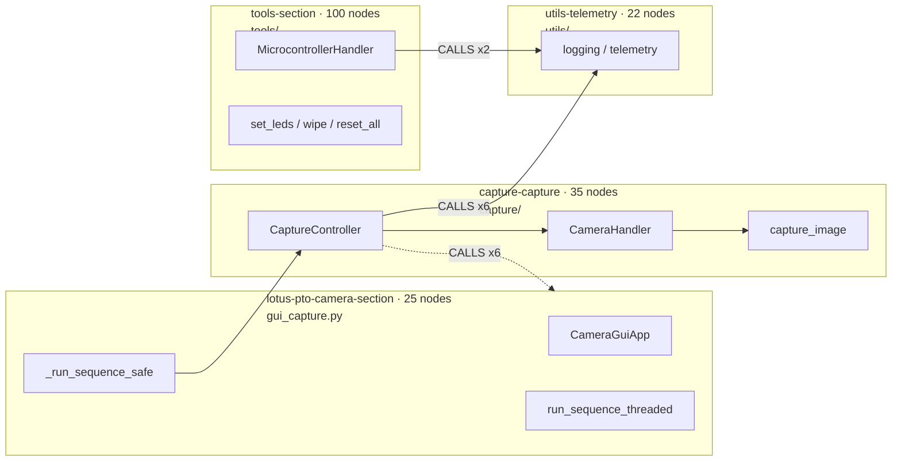

# Architecture

Diagrams for the LOTUS-PTO camera system. Generated from a trace of the
source (not only the code graph); verify against the implementation before
relying on any single path.

- [Capture sequence](#capture-sequence) — runtime call flow for a capture run.
- [UML class structure](#uml-class-structure) — capture-side object model.
- [Shared utilities and offline tools](#shared-utilities-and-offline-tools) — processing-side classes.
- [Module dependencies](#module-dependencies) — import graph.
- [Community structure (code graph)](#community-structure-code-graph) — graph-derived clusters and critical flows.

## Capture sequence

Canonical path: `main.py` CLI. Both entry points (`main.py` and
`gui_capture.py`) drive the same `CaptureController.run_capture_sequence`;
the CLI passes `capture_delay=args.capture_delay` while the GUI passes 0.

Error paths:

- `start_rig()` catches any exception, logs an `exception` event, and re-raises
  as `RuntimeError`; the `main.py` top-level handler logs `abort` and calls
  `sys.exit(1)`.
- `capture_image()` catches grab exceptions and calls `try_reconnect()`,
  returning `None`; the caller skips the save.
- `power_off_camera()` swallows its own exceptions, but it always talks to
  UniFi — so the controller must be reachable even with
  `--disable_camera --disable_microcontroller`.

## UML class structure

Capture-side object model.

## Shared utilities and offline tools

## Module dependencies

Import direction between top-level modules.

## Capture pipeline

Both entry points call `CaptureController.run_capture_sequence(steps,
capture_delay=0)`. Each `CaptureStep` carries a `camera_config` lookup name,
a `light_config` filename token, and optional manual `leds`. The CLI passes
`capture_delay=args.capture_delay` (default 1 s); the GUI passes 0.

Filenames use one schema for both entry points:
`YYYYMMDD-HHMMSS_<rig>_<camera_config>_<light_config>.png`. The GUI writes each
run under a session subdirectory (`<output>/<session>/images/YYYY-MM-DD/`) and
encodes manual LED lighting configs as `manual-<led1>-<led2>-<led3>`, so the
rig/camera-config/lighting-config tokens stay underscore-free and parse
correctly with `utils/parsing.py`.

## Community structure (code graph)

Graph-derived view of the same system, produced by `code-review-graph` from a
structural parse (Tree-sitter) of the source. Unlike the traced diagrams above,
this is a statistical clustering — treat it as a map of coupling, not as a
definitive call path, and verify against the implementation.

Snapshot: **209 nodes, 2054 edges, 25 files**, risk medium (0.67), 9 test gaps.

| Community | Source | Nodes | Cohesion | Role |
|---|---|---|---|---|
| `tools-section` | `tools/` | 100 | 0.14 | Hardware / motor control (`MicrocontrollerHandler`, `set_leds`, `wipe`, `reset_all`) |
| `capture-capture` | `capture/` | 35 | 0.25 | Camera pipeline (`CameraHandler`, `CaptureController`) |
| `lotus-pto-camera-section` | `gui_capture.py` | 25 | 0.23 | Tkinter GUI + sequence orchestration |
| `utils-telemetry` | `utils/` | 22 | 0.14 | Logging / telemetry helpers |

